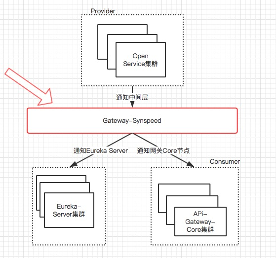
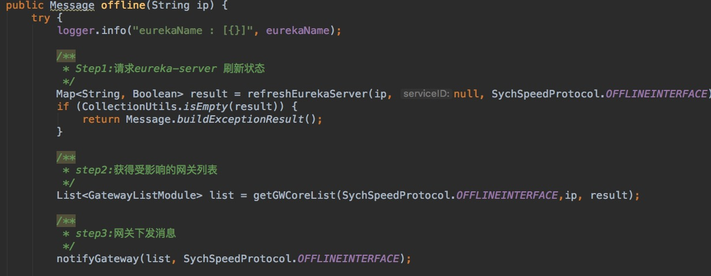
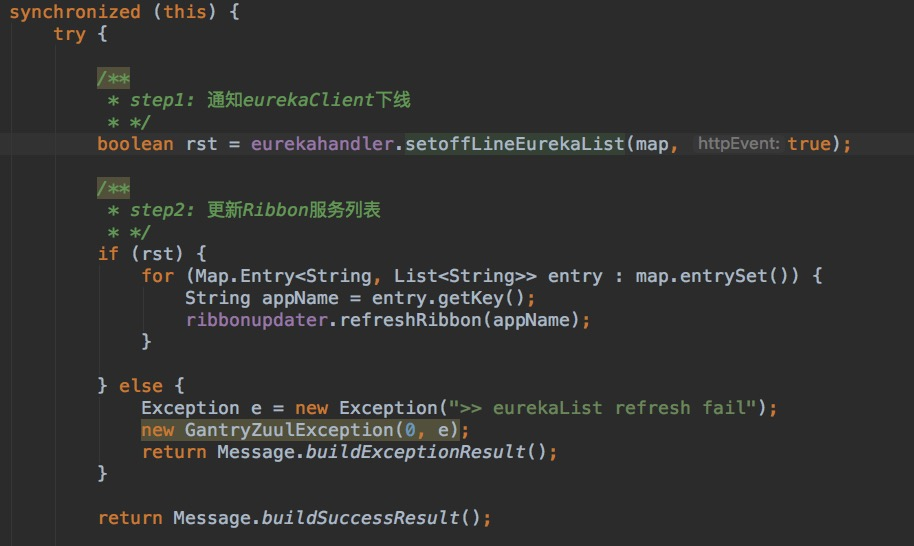
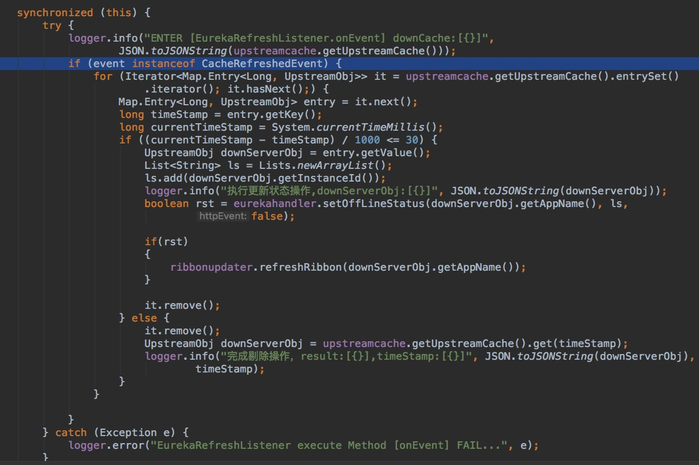

#网关如何实现服务下线实时感知
---
上一篇文章《Eureka 缓存机制》为大家介绍了Eureka的缓存机制，相信大家对Eureka 有了进一步的了解，本文要为大家介绍网关如何实现服务下线实时感知。
### 1. 前言
 + 毫无疑问，Spring Cloud是目前微服务架构领域的翘楚，Spring Cloud提供了一个全家桶式的技术栈，包含了很多组件，如：Eureka、Ribbon、Feign、Hystrix、Zuul等组件。其中Eureka是微服务架构中的注册中心，专门负责服务的注册与发现。Eureka是一个**AP**的系统，具备高可用性和分区容错性。但是Eureka Server没有基于quorum 机制实现，而是采用P2P的去中心化结构，这样相比于zookeeper，集群不需要保证至少几台Server存活才能正常工作，增强了高可用性。所以这种结构注定了Eureka不可能有zookeeper那样的一致性保证，同时因为**`Client缓存更新不及时、Server间同步失败等原因，都会导致Client可能会访问到过期的服务`**。
 
 + 这种情况对于网关来说也是一个痛点，所以如何解决网关实时感知服务下线这一问题也成了一个重要且急迫的需求。接下来首先为大家介绍下API网关的应用架构，然后再介绍
网关如何实现服务下线实时感知。

 Let`s Go.... 
### 2. API网关应用架构设计
整个平台拆分成 4 个子系统，Api-Gateway-Core（核心子系统）、Api-Gateway-Admin（管理中心）、Api-Gateway-Service（监控中心）、Api-Gateway-Stream（日志中心）。

+ Api-Gateway-Core 负责接收客户端请求，调度、加载和执行组件，将请求路由到上游服务端，处理上游服务端返回的结果等；
+ Api-Gateway-Admin 提供统一的管理界面，用户可在此进行 API、组件、系统基础信息的设置和维护；
+ Api-Gateway-Service 负责收集监控日志、生成各种运维管理报表、自动告警等；
+ Api-Gateway-stream 负责收集程序的运行日志到es,提供更全面的日志信息以及灵活的日志报表；

API网关应用架构设计图

+ 由上图可知，当Nginx接受到请求会通过Nginx负载到某一个Core节点，该Core节点会根据本地路由的缓存信息确定到Provider(下游服务提供者)的名字，然后根据这个名字通过ribbon负载到Provider的某个服务实例中。但是在某个时刻Provider下线了或者缩容了，Core节点(Eureka Client)还没有将下线服务从本地维护的注册列表中剔除掉，如果此时Core收到请求的话，ribbon会负载到已经下线的Provider，这样会出现0-239s（由上篇文章《Eureka 缓存机制》可知，服务消费者最长感知时间将无限趋近240s）请求不通的情况。

+ 能不能让Provider做主动下线，使Eureka Server立刻感知到，但是Consumer(Eureka Client端)还是会延迟感知到这个已经下线的服务。还是没有达到我们预期的效果，怎么办？ 
 此时我们想到，有人说过一句名言：
**`“计算机科学领域的任何问题都可以通过增加一个间接的中间层来解决” `**

### 3. 如何实现实时感知服务下线

网关主动感知服务下线思路图
 

+ 网关主动感知服务下线实现流程图如下：

网关主动感知服务下线实现流程图
 

**说明：** 

 +  第一步：加入中间层Gateway-SynSpeed,同步Provider下线状态到Eureka Server 和 Api-Gateway-Core,顺序是：先通知Eureka Server,然后通知与Provider所有有上下游关系的网关Core节点。

 + 第二步：Eureka Server提供状态下线接口，将Provider在Server中对应服务列表的状态置为`OUT_OF_SERVICE`（没有采用将Provider从列表中剔除掉的原因是：Provider发出下线请求后，进程不一定会立刻被kill,如果还有心跳同步到Eureka Server，Provider会从`OUT_OF_SERVICE`状态更新成UP状态）。

+  第三步：Gateway-Core 属于Eureka CLient客户端，本地会缓存Eureka Server中的所有的注册列表，接受到Gateway-Synspeed的通知后，会将Provider在Eureka Client中的状态置为`OUT_OF_SERVICE`状态，同时，通知ribbon更新它维护的缓存列表。
 
+ 第四步：在Gateway-Core将Provider的状态置为OUT_OF_SERVICE后，同时，将Provider记录在缓存DownServerCache中，key存当前时间戳，value存Provider的名字和实例ID(host:port)。
+ 第五步：监听Eureka Client的CacheRefreshedEvent事件（该事件表示Eureka Client从Eureka Server端做全量拉取操作）,对DownServerCache中的Provider做状态重置操作，最后将Provider从缓存DownServerCache中剔除掉。

**注：**
 反复测试中发现，有时还是会存在Provider依然存在Eureka Client中的情况
 
 &nbsp;&nbsp;&nbsp;&nbsp;追踪源码发现，eureka提供了一种安全保护机制。如果Provider被修改，Provider的hashcode也将改变，client端下一次从server端更新数据时，会对比当前Provider的hash值和上一次状态同步后记录hash值作对比，如果相等，做更新操作；反之，做全量拉取操作。 可能有点不太好懂，做个形象但是不太恰当的比喻：  &nbsp;&nbsp;&nbsp;&nbsp;&nbsp;&nbsp;&nbsp;小丽很喜欢漂亮衣服，每天都去商场采购新款服装，回来后都会记录这些衣服“fingerprint”，然后，下一次去商场前都会检查这些衣服的“fingerprint”，如果改变了，则代表有别人动了她的衣服，她会丢掉所有衣服，而是去商场重新购买。

### 4. 部分代码展示
 + Gateway-Synspeed做状态同步
   

   
 + Eureka Client端主动下线
  

 
 +  监听方法
   

 ### 5. 安全措施-ip白名单设计
 + 考虑到限制非法ip的访问，决定采用ip白名单设计，只允许部分许可ip访问系统，未许可ip一律禁止访问，减少非法请求。 
 

 
 

   

