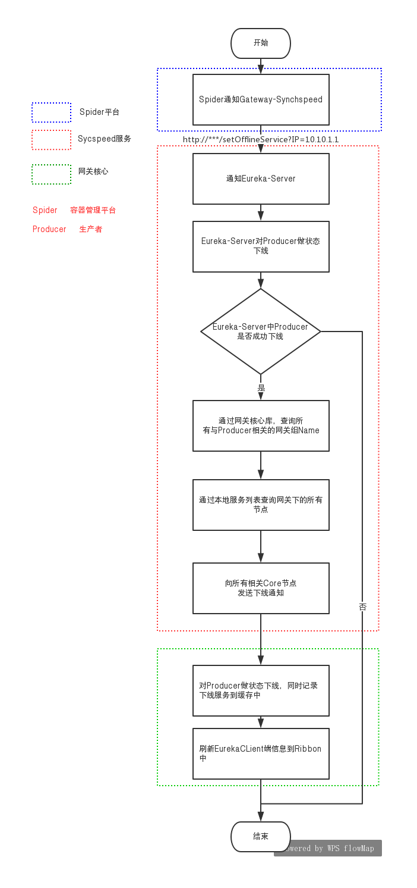
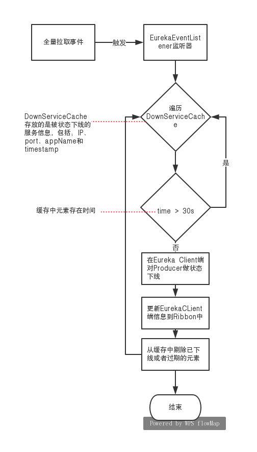
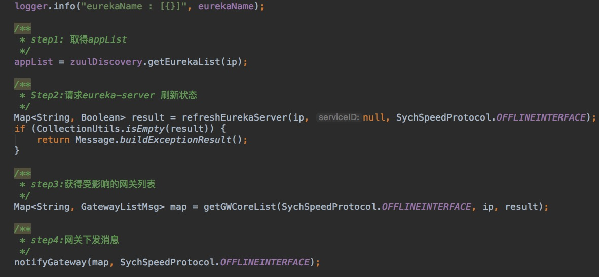
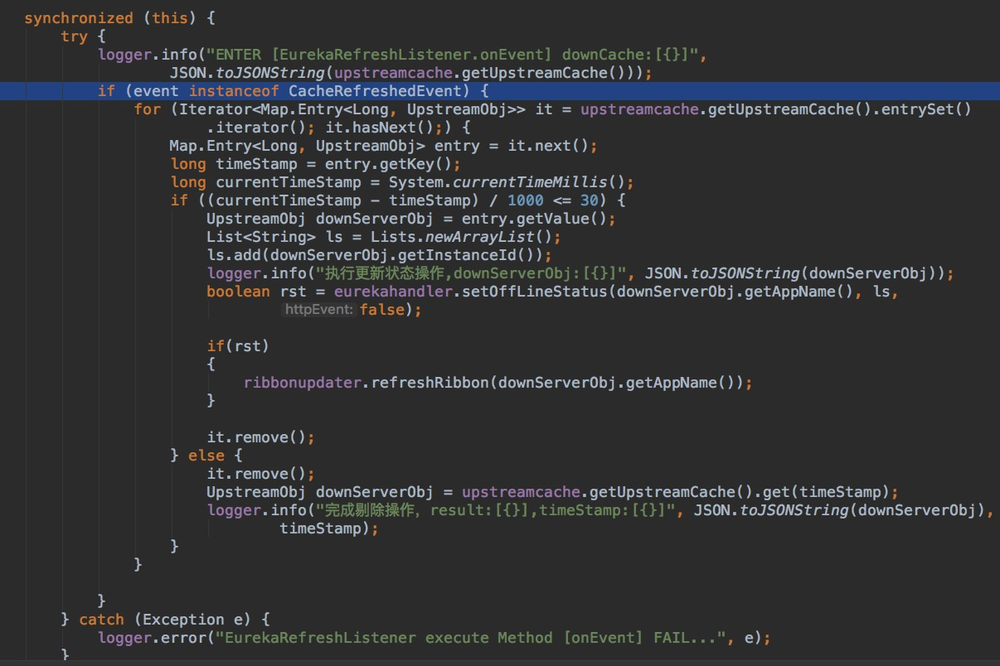

# API网关如何实现对服务下线实时感知
----
上一篇文章《Eureka 缓存机制》为大家介绍了Eureka的缓存机制，相信大家对Eureka 有了进一步的了解，本文要为大家介绍API网关如何实现服务下线的实时感知。
### 1. 前言
+ 在基于云的微服务应用中，服务实例的网络位置都是动态分配的。而且由于自动伸缩、故障和升级，服务实例会经常动态改变，因此，客户端代码需要使用更加复杂的服务发现机制。

+ 目前服务发现主要有两种模式：客户端发现和服务端发现

  + 服务端发现：客户端通过负载均衡器向服务注册中心发起请求，负载均衡器查询服务注册中心，将每个请求路由到可用的服务实例上。
  + 客户端发现：客户端负责决定可用服务实例的网络地址并且在集群中对请求负载均衡, 客户端访问服务登记表，也就是一个可用服务的数据库，然后客户端使用一种负载均衡算法选择一个可用的服务实例然后发起请求。
 
+ 客户端发现相对于服务端发现最大的区别是客户端是知道（缓存）可用服务注册表信息。如果Client端缓存没能从服务端及时更新的话，可能出现Client 与 服务端缓存数据不一致的情况。

### 2. 网关与Eureka结合使用
+ Netflix OSS 提供了一个客户端服务发现的好例子。Eureka Server 为注册中心，Zuul 相对于Eureka Server来说是Eureka Client,Zuul 会把 Eureka Server 端服务列表缓存到本地，并以定时任务的形式更新服务列表，同时zuul通过本地列表发现其它服务，使用Ribbon实现客户端负载均衡。

网关与Eureka结合使用原理图
 

+ 正常情况下，调用方对网关发起请求即刻能得到响应。但是当对生产者做缩容、下线、升级的情况下，由于Eureka这种多级缓存的设计结构和定时更新的机制，LoadBalance 端的服务列表B存在更新不及时的情况(由上篇文章《Eureka 缓存机制》可知，服务消费者最长感知时间将无限趋近240s），如果这时消费者对网关发起请求，LoadBalance 会对一个已经不存在的服务发起请求，请求是会超时的。

### 3. 解决方案
##### 3.1 实现思路
+ 生产者下线后，最先得到感知的是 Eureka Server 中 readWriteCacheMap，最后得到感知的是网关核心中 LoadBalance，但是 loadBalance 对生产者的发现是在 loadBalance 本地维护的列表中。 所以要想达到网关对生产者下线的实时感知，可以这样做：首先生产者或者部署平台主动通知 Eureka Server, 然后跳过 Eureka 多级缓存之间的更新时间，直接通知 Zuul 中的 Eureka Client,最后将 Eureka Client 中的服务列表更新到 Ribbon 中。

但是如果下线通知的逻辑代码放在生产者中，会造成代码污染、语言差异等问题。

+ 借用一句名言：
**`“计算机科学领域的任何问题都可以通过增加一个间接的中间层来解决” `**
 

网关主动感知服务下线思路图
 

  + Gateway-SynchSpeed 相当于一个代理服务，它对外提供REST API来负责响应调用方的下线请求，同时会将生产者的状态同步到 Eureka Server 和 网关核心，起着 状态同步 和 软事物 的作用。
  
  + **思路**：在生产者做 **缩容、下线、升级** 前，spider 平台（spider为容器管理平台）会主动通知 Gateway-SynchSpeed 某个生产者的某个实例要下线了，然后 Gateway-SynchSpeed 会通知 Eureka Server 生产者的某个实例下线了；如果Eureka Server 下线成功，Gateway-SynchSpeed 会直接通知 网关核心。
  + 设计特点：
   + 无侵入性、方便使用：不用关心调用方的基于何种语言实现，调用者只要对 Gateway-SynchSpeed 发起一个http rest请求即可，真正的实现逻辑不用侵入到调用方而是交给这个代理来实现。
   + 原子性：调用方先在Eureka Server下线，然后再所有相关网关核心中下线为最小工作执行单元，Gateway-SynchSpeed 相当于一个"软事物"，保证服务下线的某种程度上原子特性。

##### 3.2 实现步骤

网关主动感知服务下线实现流程图
 

**步骤说明：** 
  
 +  第一步：在生产者做 **缩容、下线、升级** 前，spider平台会以http请求的形式通知到 Gateway-SynchSpeed 服务，通知的粒度为服务实例所在的容器IP。
 
 + 第二步：Gateway-SynchSpeed 接受到请求后，先校验IP的可用性，然后通知Eureka Server。

 + 第三步：Eureka Server 将 Producer 置为失效状态，并返回处理结果（Eureka 下线形式分为两种，一种是直接从服务注册列表直接剔除，第二种是状态下线，即是将 Producer 的状态置为`OUT_OF_SERVICE`。 如果是以第一种形式下线，Spider平台发出下线请求后，不能保证Producer进程立刻被kill,如果这期间 Producer 还有心跳同步到 Eureka Server，服务会重新注册到 Eureka Server）。

 + 第四步：Gateway-SynchSpeed 得到上一步结果，如果结果为成功，则执行下一步；反之，则停止。
 
 + 第五步：Gateway-SynchSpeed 为Eureka Client。Gateway-SynchSpeed 通过 IP 到本地服务注册列表中得到 Producer 的 Application-Name。
 
 + 第六步：Gateway-SynchSpeed 通过 Application-Name 到网关核心库中查询所有与下线服务相关的 `网关组名字`。

 + 第七步：Gateway-SynchSpeed 通过 `网关组名字` 到本地服务列表中查找网关组下所有的服务地址 ipAddress(ip : port)。

+  第八步：Gateway-SynchSpeed 异步通知所有相关网关节点。

+  第九步：Gateway-Core 收到通知后，对 Producer 做状态下线，同时记录所有状态下线成功的实例信息到缓存 DownServiceCache 中。
 
+  第十步：Gateway-Core 更新本地 Ribbon 服务列表。

### 4. 补偿机制

 + Eureka 提供了一种安全保护机制。Eureka Client 从 Eureka Server 更新服务列表前，会校验相关Hash值是否改变( Client 服务列表被修改，hash值会改变)，如果改变，更新方式会从增量更新变成全量更新,（由《Eureka 缓存机制》可知这30s内  readOnlyCacheMap 和 readWriteCacheMap 的数据可能存在差异），如果Client端缓存列表被readOnlyCacheMap 覆盖，最终会导致 Ribbon 端服务列表与 readWriteCacheMap 数据不一致。

网关主动感知服务下线实现流程图
 
 
 + 针对 Eureka 这种机制，引入监听器 EurekaEventListener 作为补偿机制，它会监听 Eureka Client 全量拉取事件,对于缓存中未超过30s的服务，将其状态重新设置成 `OUT_OF_SERVICE` 。
 
###  5. API安全设计
+ 考虑到系统的安全性问题，如果被人恶意访问，可能会使生产者在Eureka Server中无辜下线，导致消费者无法通过 Eureka Server 来发现生产者。

+ 使用黑白名单做安全过滤，基本流程如下：

	+ 对 Gateway-Synchspeed 中设置白名单网段（IP网段）
	+ 在 Gateway-Synchspeed 加入过滤器,对下线请求方进行IP校验，如果请求端IP在网段中，则放行；反之，过滤。
 

### 6. 日志回溯
+ 由于 Gateway-SynchSpeed 和 Gateway-Core 是部署在 Docker 容器中，如果容器重启，会导致日志文件全部丢失。所以需要将 Gateway-SynchSpeed 和 Gateway-Core 中相关日志写入到 Elasticsearch ，最终由 Kibana 负责查询 Elasticsearch 的数据并以可视化的方式展现。

### 7. 代码片段展示
 + Gateway-SynchSpeed 做状态同步
 
  
 +  EurekaEventListener 处理缓存数据
 
   

### 8. 补充说明
+ 目前网关实现对服务下线的实时感知中，使用的 Zuul 和 Eureka 版本为 Spring Cloud Zuul 1.3.6.RELEASE 、Spring Cloud Eureka 1.4.4.RELEASE。
+ 目前网关实现的是对网关下游服务的实时感知，而且需满足以下条件：
 	+ 生产者需部署在 kubernetes 容器管理平台
 	+ 生产者做正常的**下线、升级或者缩容**操作。如果是由于容器资源不足，导致服务异常宕机等非正常下线，不支持。
+ 网关服务下线实时感知是网关对业务方提供的一种可选的解决方案，在 spider 平台中默认是没有开启此功能，是否开启此功能由业务方根据本身系统要求决定，具体如何配置可参考 **API网关接入指南** 中 《网关实时感知在spider上配置文档说明》。

----

 

 
 

   

